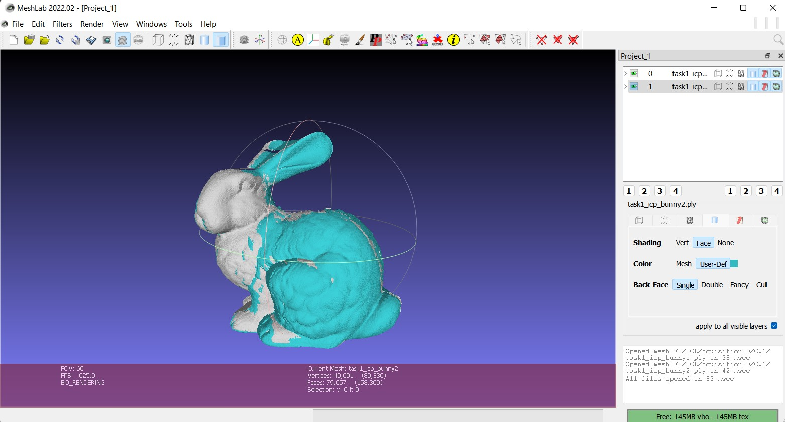
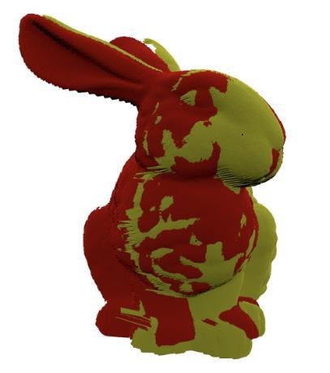
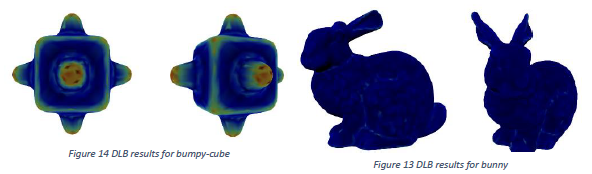
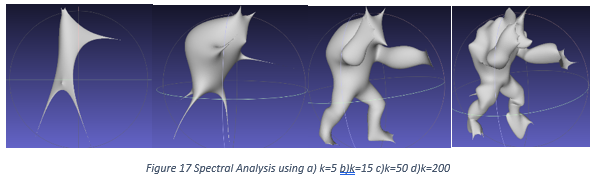
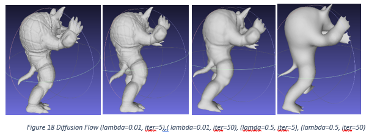
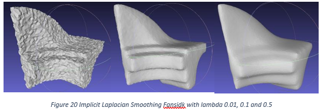

# Acquisition-and-Processing-of-3D-Geometry
This repository contains two projects from my MSc module in Acquisition and Processing of #D Geometry.
Implementations are based on specialized knowledge in 3D mesh manipulation and differential geometry.

The first project focuses on ICP implementation to align 3D meshes.
The second project focuses on Discrete Curvature and Spectral Meshes, and Laplacian Mesh Smoothing.

### Contents:

  - **Project 1**: 
      - Point-to-Point ICP
      - Point-to-Plane ICP
      - Align mesh scans from different angles to create a complete 3D model

  
  

      
   - **Project 2**: 
      - Determine Uniform Laplacian Operator
      - Determine Gaussian Curvature using a barycentric cells approach
      - First and Second fundamental forms
      - Implement the Discrete Laplace-Beltrami operator and visualize the mean curvature
      - Compute the spectral analysis for different amounts of eigenvectors
      - Implement explicit Laplacian mesh smoothing
      - Implement implicit Laplacian mesh smoothing
      - Evaluate the performances of Laplacian denoising by adding different amounts of synthetic noise to the 3D models
 

  

  

  

  

More details about the implementation and results are presented in the Report.pdf files from the directories of the projects.
